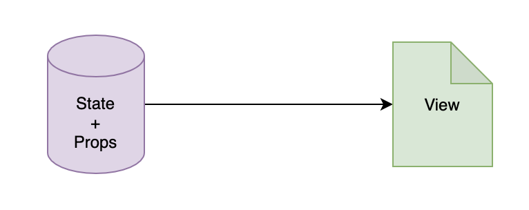
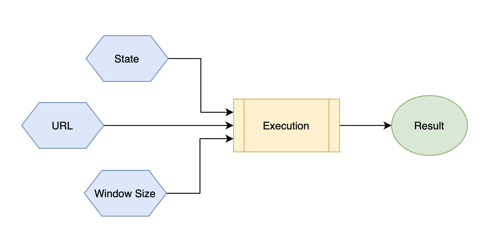

# 为什么我们需要hooks

react组件就是model（state + props）到view到映射



**数据响应式：** model改变时，UI会自动变化

ui的展现 = 一个函数的执行过程。model为输入参数，dom树为执行结果。

react需要保证的是，每次model更新时，函数重新执行，生成新的dom树，然后react再把最新的dom树更新到浏览器。

### class 和函数式组件的局限性

class作为react组件的载体时，不够合适。原因一：没法充分利用react的继承特性。原因二：所有的ui都是状态驱动的，很少直接在外部调用类的实例方法。

组件的所有方法都是在内部调用，或者作为生命周期方法被自动执行。

React出现之前，主流方式是基于对象考虑问题。需要先获取一个对象的实例，再去执行对应的方法，细粒度的处理。

而在React中，所有UI都是声明出来的，不用处理细节的变化过程，因此，通过一个函数去描述一个组件才是最自然的方式。但是，hooks出现前，函数组件的局限是**函数组件没有内部状态**，也无法提供完整的生命周期机制。

### hooks的诞生原因

- **给函数组件加上状态**
	函数没有一个实例的对象可以在多次执行期间保持状态，所以需要开辟新的空间保存这个状态，还要可以检测其变化来触发函数组件的重新渲染。
	所以，react引入了一个hooks机制，可以把一个外部的数据绑定到函数的执行，数据改变时，函数可重新执行。

Hooks 就是把**某个目标结果钩到某个可能会变化的数据源或者事件源上**，数据变化时，产生目标结果的代码重新执行，目标结果也随之更新。

hooks的结构如下图：



execution（执行过程）可以绑定（勾在）在传统意义的state，url甚至是窗口大小上。这样，这些量改变时，都会重新执行，产生更新后的结果。

### hooks的最大好处：逻辑复用

之前的react如何实现逻辑的复用？高阶组件

#### 根据窗口大小变化渲染不同组件示例

之前的Class组件场景下，需要先定义一个高阶组件用于负责监听窗口大小变化，并且把变化后的值作为props传递给下一个组件。

高阶组件缺点：

1. 代码难以理解
2. 产生冗余组件节点。

使用hooks和函数组件实现

```JavaScript
const getSize = ()=>{
  return window.innerWidth > 1000 ? "large" : "small"
}
/** 使用hooks方式封装获取窗口大小的函数 */
const useWindowSize = () => {
  const [isze, setSize] = useState(getSize())
  useEffect(()=>{
    const handler = () => {
      setSize(getSize())
    }
    window.addEventListener('resize', handler)
    return () => {
      window.removeEventListern('resize', handler)
    }
  }, [])
  return size
}
```


此处使用hooks组件的方法是把size封装成为一个可绑定的数据源，这样窗口大小发生变化时，使用这个hook的组件就都会重新渲染。

### hooks的第二个好处：有助于关注分离

函数组件中，代码从业务角度组织。

git push origin main


